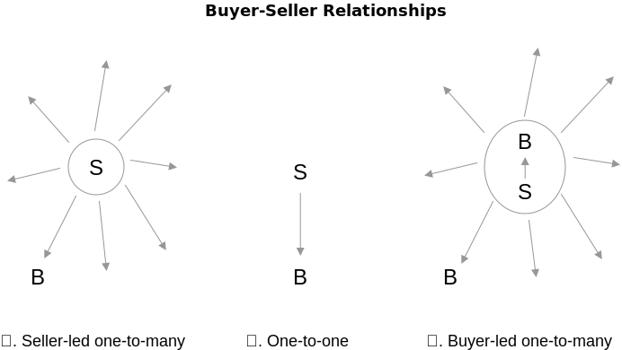
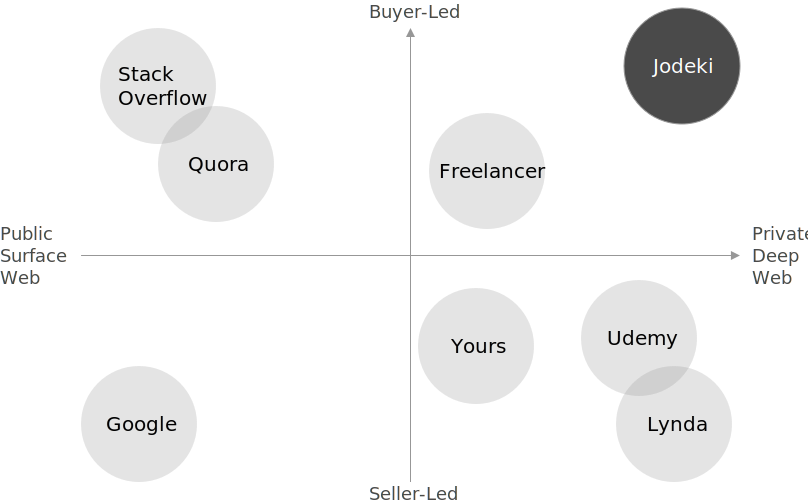

White Paper: A Decentralized Autonomous Knowledge Exchange
===
## Executive Summary <!-- omit in toc -->
Jodeki *[ʤoʊdəki]*, meaning "good job" in Japanese, is a platform that offers knowledge exchange service over a decentralized network. It is also a name of the service itself, driven by an ambitious and altruistic endeavor to tackle two major problems in modern society: 1) skewed information on the Internet that is fueled by ads, and 2) difficulty of earning a livelihood under the current money system. By applying blockchain and cryptocurrency technologies, Jodeki has invented a unique incentive structure to bring solutions to those concerns through its knowledge exchange service. Since blockchain technology is encapsulated, users can use this service without thinking about the technology.

## Contents <!-- omit in toc -->
1. [Introduction](#introduction)
    1. [A Gap Between Public and Private Information](#a-gap-between-public-and-private-information)
    2. [Attractive Reward System](#attractive-reward-system)
    3. [Technologies Under the Hood](#technologies-under-the-hood)
2. [Our Mission](#our-mission)
    1. [Better Search](#better-search)
    2. [Emancipation from Obsession with Money](#emancipation-from-obsession-with-money)
3. [Our Strategy](#our-strategy)
    1. [Seller-led vs Buyer-led Culture](#seller-led-vs-buyer-led-culture)
    2. [Incentive Structure](#incentive-structure)
    3. [Revitalizing Buyer-led Business](#revitalizing-buyer-led-business)
4. [Our Purpose](#our-purpose)
    1. [Securing User Assets](#securing-user-assets)
    2. [Feasibility Assessment](#feasibility-assessment)
    3. [Altruism](#altruism)
    4. [Quality of Knowledge](#quality-of-knowledge)
    5. [Differentiation Factors](#differentiation-factors)
5. [Our Service](#our-service)
    1. [User Income Simulations](#user-income-simulations)
    2. [Instruction Free User Experience](#instruction-free-user-experience)

## Introduction

###### A Gap Between Public and Private Information
Searching online has become the de facto standard when we seek information. Although online search engines provide a great deal of information, they only provide free content available on the surface of the web. Search engine users may want to seek for deeper knowledge from private sources by paying fees. They may hire professionals, but finding good information with a small budget is difficult. Our service aims to fill the gap by creating a platform that people can find better-than-free content by paying a small amount of fee. Thanks to blockchain technologies, a dramatic cost reduction has been made, allowing our service to become possible.

###### Attractive Reward System
All participants can benefit from our service. The key feature is our incentive structure that benefits both those who ask questions and those who provide answers. For the first round, a questioner sets fee amount and posts a question, then chooses a winner to pay and provides feedback. Thereafter, when a new user pays for the answer, both the questioner and the provider will get half-split fees. This operation keeps going as long as the smart contract is enabled. In this way, questioners will benefit as well as answerers because we believe both are equally important contributors to the knowledge base. This unique reward system encourages participants to improve the quality of the knowledge. You don't need to have special knowledge to get a reward from our service. Of course, no blockchain knowledge is required. Just ask a great question.

###### Technologies Under the Hood
Our service is based on a hypothesis that if knowledge is useful for somebody, others may also need it, too. Our aim is to create a string of knowledge measurable and transferable via the use of cryptocurrency, which is a digital currency used on the Internet as a medium of exchange. Encryption techniques are utilized to generate and regulate different units of such currency. And these encryption techniques also have the ability to verify the transfer of funds. Once a transaction is complete, knowledge, which will be stored on the blockchain, can be easily transferred. Thereby we built a decentralized autonomous knowledge exchange. We use Ether (ETH) as cryptocurrency on Ethereum blockchain to run our smart contracts. Smart contracts can operate on blockchain and securely execute its program at very low cost, therefore we use them to reduce security and operational costs. Jodeki uses smart contracts to build a knowledge base on the blockchain via a question-and-answer method. Since those technical details are encapsulated, users don't need to know more than this information, in order to use our service.

## Our Mission

###### Better Search
We want to provide high-quality search functions through ads-free private information retrieval. Since most public web services implement ads for monetization at the expense of contents quality, the Internet search results can be skewed towards ads. We removed ads and allow users to get information from private sources with a little fee and make Internet search more efficient. We designed an attractive reward system to encourage users to provide knowledge at their best, thereby users begin helping to change how Internet users of the world can gain access to the best knowledge easier.

###### Emancipation from Obsession with Money
We believe humans can gain valuable knowledge from experience anytime and anywhere. However, it is often invisible and volatile, therefore has no value to other people. Our mission is to minimize the energy of confining your knowledge into money by enabling it to be measurable, storable, and reusable. If we can store such a volatile value and exchange with money easily, we don't need to concern too much about future livelihood because we can generate money when necessary.

## Our Strategy

###### Seller-led vs Buyer-led Culture
Our service is, in a nutshell, a question-and-answer style marketplace where users can buy and sell knowledge. The significant characteristic is its buyer-led culture. In the standard business procedure, a seller finds a business opportunity and creates products and distribute them to buyers. The leadership of the business such as what to sell, how much to receive is on the seller side. However, in our service, the leadership is on the buyer side. For example, a knowledge buyer finds an interesting topic and ask a question by offering price to get an answer. Then, the answer will be redistributed to future buyers by the smart contract. The contract will keep generating revenue until the original buyer stops it. Therefore, we want to treat information have-nots to be the leading player.

###### Incentive Structure
We designed an attractive reward system to maintain high-quality knowledge base. In terms of fee distribution, we charge 15% for each transaction to improve service quality. For the first round, the answer provider will receive 85%. From the second round thereafter, 85% will be split into halves, therefore the answer provider and the original buyer will receive 42.5% each for contributing to the knowledge base. Through those conditions, we motivate participants to generate returns over the long run and create a well-intended atmosphere such that:

1. Users want to ask a question in a way that many people will also want to know the answer.
2. Users want to provide their best answer in a way that many people can understand.
3. Users want to use Jodeki as early as possible to gain first-mover advantage.

###### Revitalizing Buyer-led Business
Before blockchain and cryptocurrency, there existed businesses that buyer can decide prices such as consulting or house building. However, those businesses are designed to be (ⅱ) one-to-one relationship, there's no chance of profit scaling that (ⅰ) one-to-many relationship has. Therefore, buyer-led business for a small fund such as one dollar was unthinkable. Now we made it possible with these new technologies––we reduce operational costs dramatically and let smart contracts work for us. Our incentive model enables extending one-to-one topology to (ⅲ) one-to-many, allowing scale-up revenue creation.

## Our Purpose

###### Securing User Assets
Since our platform is decentralized, users' money, the knowledge base, and the smart contracts are not stored in our proprietary server. In this way, we ruled out the risk of being hacked, because there's no single point of failure. At the worst case, a cyber attack might be able to shut down our application server. However, user assets will be secured on the blockchain and they can use our service without problem through the client app installed on their smartphones and computers.

###### Feasibility Assessment
In addition to the security benefits, Jodeki enables a dramatic cost reduction. Our smart contracts are deployed on the Ethereum network and will execute functions such as sending money or retrieving information with very low cost (i.e., estimated less than 5 cents as of 3 August 2018). The costs of running application servers and database servers, security hardening are not affected by the increase of user base on the blockchain, while on the other hand, those costs without blockchain increase approximately linearly with the number of users.

###### Altruism
Our primary purpose is not generating profits. Rather, we want to maximize the client's benefit. Competitors funded by venture capitals might be able to develop the same incentive system and user interface, but they have to maximize profits for their investors; therefore the benefit of users would be spoiled. Hence, we aim to provide another source of income and wisdom at their hand, to help users achieve self-realization. Since we are different from an economic enterprise, our position in the market is unique. We are not looking for external investors, nor income from ads. Instead, we are looking for participants; therefore, our growth strategy is a bootstrap method relying on the size and activity of our user community.

###### Quality of Knowledge
Our knowledge base aims to be more valuable than Google's database––it is possible because our data is collected from private sources. [This research](https://quod.lib.umich.edu/j/jep/3336451.0007.104?view=text;rgn=main) authored by Michael K. Bergman titled *The Deep Web: Surfacing Hidden Value* shows that the deep web which includes private sources has 500 times more data and many times greater quality compared to the surface web. Since the information Jodeki collect is in the deep web, its volume and quality can be greater than that of search engines collected from the indexable public web.

###### Differentiation Factors
Similar services already exist, but those are different in terms of who creates content and where does the content come from. Most companies provide information from the surface web, and their revenue model is mainly from ads (Google, StackOverflow, Quora). Other services such as Lynda, Udemy, and Yours create content for membership users or content buyers. In Freelancer, users lead content creation by hiring professionals in private space; therefore, its business is the one-to-one model and not scalable. However, Jodeki offers scalable business platform based on a buyer-led one-to-many relationship.

## Our Service

###### User Income Simulations
A sample questioner A asks a hundred of one-dollar-worth questions and each acquires ten buyers in the first month, they will receive 325 dollars value of ether `($-1 * 100 + $1 * 100 * 10 * 0.425 = $325)`. If no additional questions are made but there are ten more buyers in the second month, they will receive 425 dollars value of ether `($1 * 100 * 10 * 0.425 = $425)`. In more successful case, a highly reputable questioner B asks a hundred-dollar-worth question that acquires one thousand buyers, they will receive 42,400 dollars value of ether `($-100 + $100 * 1000 * 0.425 = $42,400)`. Questioners and answerers can both increase rewards by optimizing questions price, a number of questions and answers, and a number of sales. 

| Name-Month | Avg Price | Num Q&A | Num Sold | Reward Rate | Reward  |
| :--------: | --------: | ------: | -------: | :---------: | ------: |
| A-1        | $1        | 100     | 10       | 42.5%       | $325    |
| A-2        | -         | -       | 10       | 42.5%       | $425    |
| B-1        | $100      | 1       | 1000     | 42.5%       | $42,400 |

###### Instruction Free User Experience
We designed our service to be intuitively obvious. Since all the complicated technology is encapsulated, no blockchain knowledge is needed. The usage is essentially the same as posting a message on Twitter. Just go to [Jodeki.com]() and create a user account and save an Ethereum address to pay and receive Ether. Then you are all set. Let's start asking a question or answering a question from your browser or smartphones/desktop applications that you download from the website.
