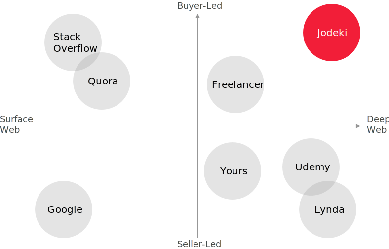

White Paper: A Decentralized Autonomous Knowledge Exchange
===
## Executive Summary <!-- omit in toc -->
Jodeki *[ʤoʊdəki]*, meaning "good job" in Japanese, is a platform that offers knowledge exchange services over a decentralized network. It is also a name of the service itself, driven by an ambitious and altruistic endeavor to tackle two major problems in modern society: 1) skewed information on the Internet that is fueled by ads, and 2) the difficulty of earning a livelihood under the current monetary system. By applying blockchain and cryptocurrency technologies, Jodeki has invented a unique incentive structure to bring solutions to those concerns through its knowledge exchange services. Since blockchain technology is encapsulated, users can use this service without thinking about the technology.

## Contents <!-- omit in toc -->
1. [Introduction](#introduction)
    1. [A Gap Between Public and Private Information](#a-gap-between-public-and-private-information)
    2. [Attractive Reward System](#attractive-reward-system)
    3. [Technologies Under the Hood](#technologies-under-the-hood)
2. [Our Mission](#our-mission)
    1. [Better Search](#better-search)
    2. [Emancipation from Obsession with Money](#emancipation-from-obsession-with-money)
3. [Our Strategy](#our-strategy)
    1. [Seller-Led vs. Buyer-Led Culture](#seller-led-vs.-buyer-led-culture)
    2. [Incentive Structure](#incentive-structure)
    3. [Revitalizing Buyer-Led Business](#revitalizing-buyer-led-business)
4. [Our Purpose](#our-purpose)
    1. [Securing User Assets](#securing-user-assets)
    2. [Feasibility Assessment](#feasibility-assessment)
    3. [Altruism](#altruism)
    4. [Quality of Knowledge](#quality-of-knowledge)
    5. [Differentiation Factors](#differentiation-factors)
5. [Our Service](#our-service)
    1. [User Income Simulations](#user-income-simulations)
    2. [Instruction Free User Experience](#instruction-free-user-experience)

## Introduction

###### A Gap Between Public and Private Information
Searching online has become the de facto standard when we seek information. Although online search engines provide a great deal of information, they only offer free content available on the surface of the web. Search engine users may want to seek for more profound knowledge from private sources by paying fees. They may hire professionals, but finding valuable information with a small budget is difficult. Jodeki aims to fill the gap by creating a platform on which people can discover better-than-free content by paying a small fee amount. Thanks to blockchain technologies, costs were reduced dramatically, allowing our service to become feasible.

###### Attractive Reward System
All participants can benefit from using Jodeki. The critical feature is its incentive structure that motivates both those who ask questions and those who provide answers. For the first round, an asker sets the fee amount and posts a question topic, then chooses a winner to pay and provides feedback. After that, when a new user pays for the answer, the questioner and the provider get half of the revenue. This operation keeps going as long as the smart contract is enabled. In this way, askers will benefit as well as answerers because we believe both are equally important contributors to the knowledge base. This unique reward system encourages participants to improve the quality of the questions and answers. You don't need to have specialized knowledge to get a reward from Jodeki. Of course, no blockchain knowledge is required. Just ask a great question.

###### Technologies Under the Hood
Jodeki operates on a hypothesis that if knowledge is useful for somebody, others may also need it. It aims to create a string of expertise measurable and transferable via the use of cryptocurrencies, which are digital currencies used on the Internet. Encryption techniques are utilized to generate and regulate different units of such money. Moreover, these encryption techniques can also verify the transfer of funds. Once a transaction is complete, knowledge, which will be stored on the blockchain, can be easily transferred. We thereby built a decentralized and autonomous knowledge exchange. Jodeki uses Ether (ETH) as cryptocurrency on Ethereum blockchain to run its smart contracts. Smart contracts can operate on blockchain and securely execute its program at little cost; therefore, Jodeki uses them to reduce security costs and operational costs. Moreover, the smart contracts are used to build a knowledge base on the blockchain via a question-and-answer method. Because Jodeki encapsulates those technical details, users do not need to understand more than this information.

## Our Mission

###### Better Search
Jodeki aspires to provide high-quality search functions through ads-free private information retrieval. Since most public web services implement ads for monetization at the expense of content quality, Internet search results can be skewed towards ads. We removed the ads and have allowed users to get information from private sources with a little fee. This makes Internet search more efficient. We also designed an attractive reward system to encourage users to provide their best knowledge. Consequently, users are helping to change how other Internet users of the world can more easily gain access to the best knowledge possible.

###### Emancipation from Obsession with Money
We believe humans can gain valuable knowledge from experience anytime and anywhere. However, it is often invisible and volatile and, therefore, has no value to other people. Jodeki's mission is to minimize the energy of converting your knowledge into money by enabling it to be measurable, storable, and reusable. If we can store such a volatile value and exchange it for cash quickly, we don't need to concern ourselves too much about future livelihoods because we can generate money when necessary.

## Our Strategy

###### Seller-Led vs. Buyer-Led Culture
Jodeki is, in a nutshell, a question-and-answer style marketplace where users can buy and sell knowledge. The significant characteristic is its buyer-led culture. In the standard business procedure, a seller finds a business opportunity and creates products and distributes them to buyers. The leadership of the business, such as what to sell and how much to receive is on the seller side. However, in Jodeki, the information buyer is in control. For example, a user finds an engaging topic and asks a question by offering a price to get an answer. Then, the answer will be redistributed to future buyers by the smart contract. The contract will keep generating revenue until the original buyer stops it. Therefore, we want to give information have-nots the chance to be leading players.

###### Incentive Structure
We designed an attractive reward system in order to maintain a high-quality knowledge base. Concerning fee distribution, Jodeki charges 15% for each transaction to improve service quality. For the first round, the answer provider will receive 85%. After the second round, the 85% will be split into halves; therefore the answer provider and the original buyer will receive 42.5% each for contributing to the knowledge base. Through these conditions, we motivate participants to generate returns in the long run and create a well-intended atmosphere such that:

1. Users will want to ask a question in a way that many people will also want to know the answer.
2. Users will want to try their best to answer in a way that many people can understand.
3. Users will want to use Jodeki as early as possible to gain first-mover advantages.

###### Revitalizing Buyer-Led Business
Before blockchain and cryptocurrency, businesses existed where the buyer could decide prices on items such as consulting or house building. However, those businesses are designed to be (ⅱ) one-to-one relationships, and there is no chance of profit scaling that a (ⅰ) one-to-many relationship has. Thus, a buyer-led business for a small fund such as one dollar was unthinkable. Now, Jodeki has made it possible with these new technologies––reducing operational costs dramatically and letting smart contracts work for us. Our incentive model enables extending one-to-one topology to (ⅲ) one-to-many, allowing scale-up revenue creation.

## Our Purpose

###### Securing User Assets
Since Jodeki is a decentralized platform, users' money, the knowledge base, and the smart contracts are not stored in its proprietary server. In this way, it rules out the risk of being hacked, because there's no single point of failure. In the worst case, a cyber attack might be able to shut down the application server. However, user assets will be secured on the blockchain, and users can use Jodeki without problem through the client app installed on their smartphones and computers.

###### Feasibility Assessment
In addition to the security benefits, Jodeki enables a dramatic cost reduction. Jodeki's smart contracts are deployed on the Ethereum network and will execute functions such as sending money or retrieving information with little cost (i.e., estimated at less than 5 cents as of 3 August 2018). The costs of running application servers and database servers, and of security hardening are not affected by the increase of user base on the blockchain while, on the other hand, those costs without blockchain increase approximately linearly with the number of users.

###### Altruism
Jodeki's primary purpose is not generating profits. Instead, Jodeki wants to maximize the client's benefit. Competitors funded by venture capitals might be able to develop the same incentive system and user interface, but they have to maximize profits for their investors; therefore, the benefit of users would be spoiled. Hence, Jodeki aims to provide another source of income and wisdom at hand, to help users achieve self-realization. Since Jodeki is different from an economic enterprise, its position in the market is unique. It is not looking for external investors or income from ads. Instead, it is looking for participants; therefore, its growth strategy is a bootstrap method relying on the size and activity of the user community.

###### Quality of Knowledge
Jodeki's knowledge base aims to be more valuable than Google's database––it is possible because Jodeki collects information from private sources. [This research](https://quod.lib.umich.edu/j/jep/3336451.0007.104?view=text;rgn=main) authored by Michael K. Bergman titled *The Deep Web: Surfacing Hidden Value* shows that the deep web which includes private sources has 500 times more data and many times greater quality compared to the surface web. Since Jodeki builds a knowledge base from the deep web, the knowledge volume and quality can be higher than that of search engines collection from the indexable public web.

###### Differentiation Factors
Similar services already exist, but those are different regarding who creates content and from where it comes. Most companies provide information from the surface web, and their revenue model is mainly from ads (Google, StackOverflow, Quora). Other services such as Lynda, Udemy, and Yours create content for membership users or content buyers. At Freelancer, users obtain content by hiring professionals in the private space; therefore, its business is a one-to-one model and not scalable. However, Jodeki offers scalable business platform based on buyer-led one-to-many relationships.

## Our Service

###### User Income Simulations
A sample Questioner A asks a hundred one-dollar-worth questions, and each acquires ten buyers in the first month. They will receive \$325 value of ether `($-1 * 100 + $1 * 100 * 10 * 0.425 = $325)`. If they don't ask additional questions, however, there are ten more buyers in the second month, they will receive \$425 value of ether `($1 * 100 * 10 * 0.425 = $425)`. In a more successful case, a highly reputable Questioner B asks a hundred-dollar-worth question, and it acquires one thousand buyers. They will receive \$42,400 value of ether `($-100 + $100 * 1000 * 0.425 = $42,400)`. Questioners and answerers can both increase rewards by optimizing the offer price of questions, the number of questions or answers, and the number of sales.

| Name-Month | Avg Price | Num Q&A | Num Sold | Reward Rate | Total Income |
| :--------: | --------: | ------: | -------: | :---------: | -----------: |
| A-1        | $1        | 100     | 10       | 42.5%       | $325         |
| A-2        | -         | -       | 10       | 42.5%       | $425         |
| B-1        | $100      | 1       | 1000     | 42.5%       | $42,400      |

###### Instruction Free User Experience
Jodeki is designed to be intuitively obvious. It made all the complicated technology tucked away, so no blockchain knowledge is needed to use the service. The usage is as comfortable as posting a message on Twitter. Just go to [Jodeki.com]() and create a user account and save an Ethereum address to pay and receive fees in Ether (ETH). Then, you are all set. Let's start by asking a question or answering a question from your browser or smartphones/desktop applications that you can download from the website.
